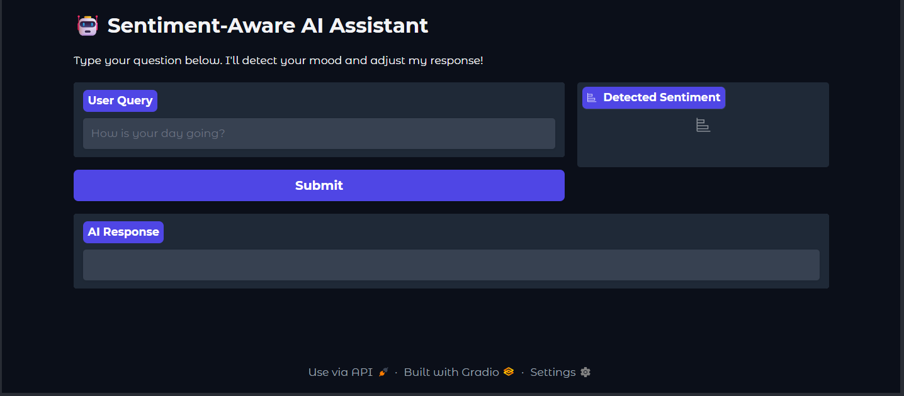
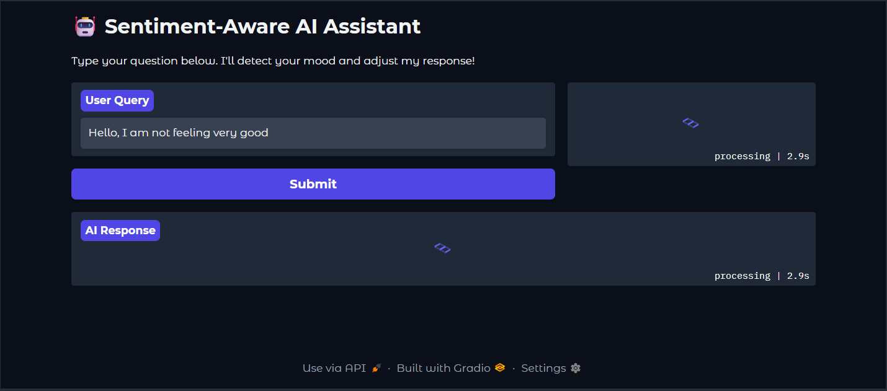
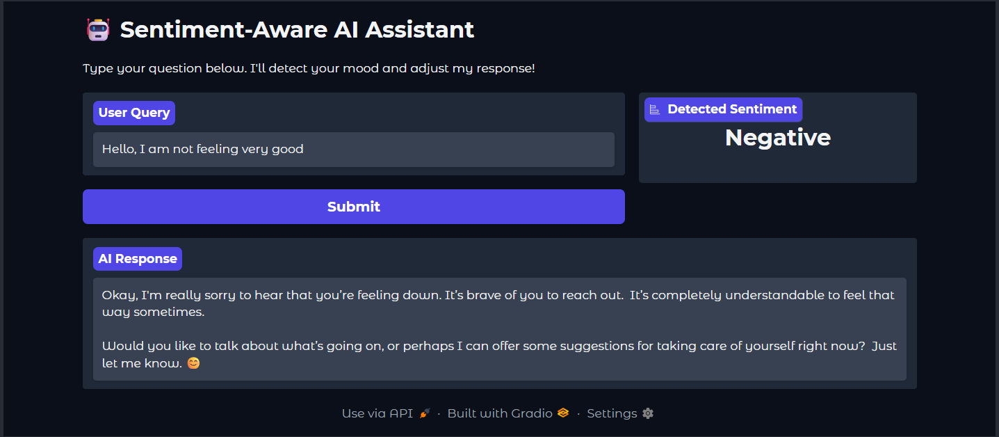

# Report Lab Exercise 03 Enrique Posada

## Problem Description

**Sentiment Aware AI-Powered Chatbot**

Nowadays, with chatbots getting more and more popular and advanced, there is a need for chatbots to be aware of the sentiment of the user in order to give better and personalized responses. This is what this project tries to assess, change the responses based on if the user sentiment is positive, neutral or negative.

## System Design and Workflow

**User Interface**
The user interface is a web-base frontend built using gradio, which allows the user to write a text in a box, submit the text with a button and shows the predicted sentiment of the query and the chatbot answer.

**Application Logic**
The whole logic is based on two functions:
- `sentiment_analysis(user_query)`: Given a user query, the function calls ollama model gemma3:1b, to return positive, neutral or negative
- `qna_orchestrator(user_query, sentiment)`: Given a user query and its sentiment, the function changes the system prompt to adequate to different sentiments and call the ollama model gemma3:1b to generate an answer to the user query.

There is a third function that combines both function
`master_process(user_query)`: Given a user query, first calls `sentiment_analysis(user_query)` passing that user query, which returns the sentiment of the query, then, calls `qna_orchestrator(user_query, sentiment)` passing the same query and the predicted sentiment. The function returns the sentiment and the system response.

The interaction logic is easy and concise, just taking the query that the user writes on the interface and passing it to the `master_process(user_query)`. The returned outputs are shown in the AI Response box and the detected sentiment box.

**Local Inference Engine**
The inference is run locally through a background service hosting the Gemma 3:1b model, exposed via a local REST API (localhost:11434). Which is called in both application logic functions.

**Workflow**
- Input Capture: The user submits a query through the Gradio Textbox.
- Sentiment Classification: The application sends the query to the LLM with a classification prompt.
- Prompt Engineering: Based on the sentiment classification result, the logic selects a system persona.
  - If Negative -> Use the Empathy/Solution prompt.
  - If Positive -> Use the Enthusiastic/Emoji prompt.
  - If Neutral  -> Use the Professional/Colloquial prompt.
- Final Generation: A second call is made to the LLM combining the system persona with the persistent system prompt.
- UI Update: The gradio interface updates the detected sentiment and the AI Response Box with the AI generated answer.

## Model Selection and justification

**Selected Model**
Gemma 3:1b using Ollama

**Justification**
I chose it because it offers extremely low latency for classification tasks while remaining "smart" enough to follow complex system instructions for the QnA phase.

## Implementation details (tools, frameworks, decisions)

**Core Tools and Frameworks**
- Inference Engine: Ollama. Chosen for its ability to manage local LLM, provide an easy to use standardized REST API, and being efficient on consumer hardware.

- GUI Framework: Gradio. Selected over Streamlit or Flask for its integration with Jupyter Notebooks.

- LLM Model: Gemma 3:1b.

## Discussion of results, limitations, and possible improvements
**Results**
The results are pretty good and alligned with the desired objective, the LLM manages to correctly classify the sentiment in the most cases. And when is mistaken, it rarely is confusing positive with negative, instead, it can confuse positive with neutral, or neutral with negative.

Regarding the AI responses, they are very good and is adequates to the given system persona (the sentiment of the query). This demonstrates that by giving context into the second stage of the pipeline (Response generating), the model successfully overcomes the 'flat' tone of standard chatbots. The resulting output is not just a factual answer, but a contextually aware interaction that simulates human emotional intelligence and empathy.

**Limitations**
- Hard time handling irony.
- Not perfect sentiment classification, what hurts the response generation.
- Some responses may be too long for a normal conversation.
- The time needed for generating responses may be a bit high, which is increased with longer responses

**Improvements**
- Video Fusion, which would help catching ironies and other apsects that may favour the classification
- Better prompt engineering (there is alwyas room for this)
- Giving it access to data related with how to interact with people in bad mood.

## Screenshots of the application
**Initial State & User Interface Overview**
 

**Active Inference & Pipeline Execution**
 

**Sentiment-Aware Response Generation**
 